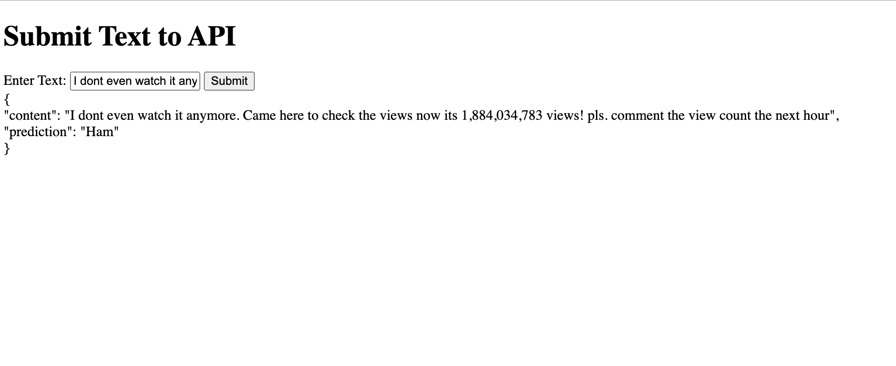

# Youtube_Spam_Comments_Detector

This project aims to classify YouTube comments as spam or ham using supervised machine learning models. The application is built using FastAPI and Docker for deployment.

## Project Overview

Identifying and blocking spam comments on YouTube videos is crucial to avoid data breaches, cybersecurity issues, and to improve user experience. This project implements various machine learning models to accurately classify comments and ensure legitimate comments are not blocked.

## Models Used

- Logistic Regression
- Naive Bayes
- k-Nearest Neighbors (kNN)
- Random Forest
- MLP Classifier
- SVC
- Voting Classifier
- XGBoost

## Achievements

- Developed and optimized 8 machine learning models, including ensemble methods, neural networks, and Naive Bayes, to classify YouTube comments as spam or ham.
- Employed NLP techniques for text processing and used grid search cross-validation for parameter tuning.
- Evaluated and enhanced model efficacy with various performance metrics, achieving an accuracy of 96.4%.
- Deployed the model using FastAPI and Docker, with Swagger documentation for the API endpoints.

## Setup Instructions

### Prerequisites
- IDE (Visual Studio)
- Python
- Flask
- Docker

### Install the dependencies:

```
pip install -r requirements.txt
```

### Build the Docker image: 

```
docker build -t youtube-comments-spam-detector .
```

### Run the Docker container: 

```
docker run -d -p 8000:8000 youtube-comments-spam-detector
```

Open your browser and go to http://localhost:8000/docs to access the Swagger documentation and interact with the API.

## Example:


